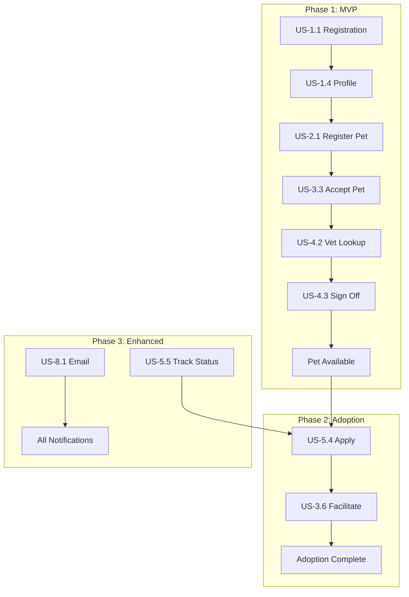

# Forever Home - Product Roadmap

> **PM Overview**: This document outlines the complete implementation roadmap for Forever Home, organized by priority phases with clear deliverables and dependencies.

---

## Executive Summary

Forever Home is a pet adoption platform with a trust-based model:
- **Fosters** register pets for adoption
- **Rescue Organizations** manage pets and facilitate adoptions
- **Vets** verify pet health (neutered, vaccinated, healthy)
- **Adopters** find and apply for verified pets

### Current Status (December 2025)
- **Core flows**: Authentication, pet browsing, favorites - **Working**
- **Critical bugs**: Rescue org dashboard (500 errors), vet lookup API (404)
- **Phase**: MVP features mostly complete, several P1 features in progress

---

## Phase Overview

```
┌─────────────────────────────────────────────────────────────────────────────┐
│  PHASE 1: MVP Foundation                                    [IN PROGRESS]   │
│  Core registration, browsing, verification flows                            │
├─────────────────────────────────────────────────────────────────────────────┤
│  PHASE 2: Complete Adoption Flow                            [NOT STARTED]   │
│  Applications, facilitation, pet management                                 │
├─────────────────────────────────────────────────────────────────────────────┤
│  PHASE 3: Enhanced Experience                               [NOT STARTED]   │
│  Notifications, favorites, password recovery, history                       │
├─────────────────────────────────────────────────────────────────────────────┤
│  PHASE 4: Polish & Scale                                    [NOT STARTED]   │
│  Public pages, analytics, moderation, search                                │
└─────────────────────────────────────────────────────────────────────────────┘
```

---

## Phase 1: MVP Foundation (P0) #mvp

> **Goal**: Users can register, browse pets, and complete the vet verification flow

### 1.1 Authentication & Registration
| Story | Description | Status | Notes |
|-------|-------------|--------|-------|
| US-1.1 | User Registration (all roles) | Done | All role types working |
| US-1.2 | User Login | Done | JWT auth functional |
| US-1.4 | Complete Profile | Done | Role-specific profiles |

### 1.2 Pet Browsing
| Story | Description | Status | Notes |
|-------|-------------|--------|-------|
| US-5.1 | Browse Available Pets | Done | Public + authenticated |
| US-5.3 | View Pet Profile | Done | Gallery, vet badge working |

### 1.3 Foster Flow
| Story | Description | Status | Notes |
|-------|-------------|--------|-------|
| US-2.0 | Browse Rescue Organizations | Partial | UI exists, needs testing |
| US-2.1 | Register Pet for Adoption | Partial | Form exists, full flow untested |

### 1.4 Rescue Organization Flow
| Story | Description | Status | Notes |
|-------|-------------|--------|-------|
| US-3.1 | Create Organization Profile | Done | Profile creation working |
| US-3.3 | Accept Pet Registrations | **Blocked** | #bug 500 errors on API |

### 1.5 Vet Verification Flow
| Story | Description | Status | Notes |
|-------|-------------|--------|-------|
| US-4.2 | Look Up Pet by Microchip | **Blocked** | #bug 404 on API, uses mock |
| US-4.3 | Sign Off on Pet | Partial | UI ready, needs API |

### 1.6 Admin Basics
| Story | Description | Status | Notes |
|-------|-------------|--------|-------|
| US-6.1 | Approve Rescue Org Registrations | Done | Queue functional |

### Phase 1 Blockers #blocked

```
┌─────────────────────────────────────────────────────────────────────────────┐
│  CRITICAL: Fix before proceeding to Phase 2                                 │
├─────────────────────────────────────────────────────────────────────────────┤
│  1. [BUG] Rescue Org Dashboard 500 Errors                                   │
│     - Endpoints: /api/rescue/*                                              │
│     - Impact: Rescues cannot manage pets                                    │
│     - Files: RescueOrgController.java, RescueOrgService.java                │
│     - Similar to: Adopter favorites bug (profile lookup issue)              │
├─────────────────────────────────────────────────────────────────────────────┤
│  2. [BUG] Vet Pet Lookup API 404                                            │
│     - Endpoint: /api/vet/pets/microchip/{microchipId}                       │
│     - Impact: Vets cannot look up pets for verification                     │
│     - Files: VetController.java, VetService.java                            │
│     - Workaround: Frontend uses mock data                                   │
└─────────────────────────────────────────────────────────────────────────────┘
```

### Phase 1 Deliverables Checklist

- [x] Users can register with any role
- [x] Users can log in and access dashboards
- [x] Visitors can browse available pets
- [x] Adopters can favorite pets #fixed
- [ ] Fosters can register pets with rescue organizations
- [ ] Rescue orgs can accept pet registrations
- [ ] Vets can look up pets by microchip
- [ ] Vets can complete sign-off (pet → Available)
- [x] Admins can approve rescue organizations

---

## Phase 2: Complete Adoption Flow (P1) #core

> **Goal**: Full adoption cycle from application to completion

### 2.1 Foster Management
| Story | Description | Dependencies | Notes |
|-------|-------------|--------------|-------|
| US-2.2 | Edit Pet Profile | US-2.1 | Microchip immutable |
| US-2.3 | View Pet Status | US-2.1 | Timeline component |

### 2.2 Adopter Applications
| Story | Description | Dependencies | Notes |
|-------|-------------|--------------|-------|
| US-5.2 | Filter Pets | US-5.1 | Species, breed, size, age |
| US-5.4 | Apply to Adopt | US-5.3 | Max 3 active applications |

### 2.3 Rescue Facilitation
| Story | Description | Dependencies | Notes |
|-------|-------------|--------------|-------|
| US-3.5 | View Organization's Pets | US-3.3 | Filter by status |
| US-3.6 | Facilitate Adoption | US-5.4 | Review, approve, finalize |
| US-3.7 | Approve Vets | - | Organization-specific trust |

### Phase 2 Deliverables Checklist

- [ ] Fosters can edit pet profiles (except microchip)
- [ ] Fosters can view pet status timeline
- [ ] Adopters can filter pets by criteria
- [ ] Adopters can submit adoption applications
- [ ] Rescue orgs can view all their pets
- [ ] Rescue orgs can review and approve applications
- [ ] Rescue orgs can finalize adoptions
- [ ] Rescue orgs can approve/revoke vet access

---

## Phase 3: Enhanced Experience (P2) #enhanced

> **Goal**: Improve user experience with notifications, recovery, and tracking

### 3.1 User Account
| Story | Description | Dependencies | Notes |
|-------|-------------|--------------|-------|
| US-1.3 | Password Recovery | US-1.1 | 24-hour reset links |

### 3.2 Foster Features
| Story | Description | Dependencies | Notes |
|-------|-------------|--------------|-------|
| US-2.4 | Withdraw Pet | US-2.1 | Requires rescue approval if InProgress |

### 3.3 Vet Features
| Story | Description | Dependencies | Notes |
|-------|-------------|--------------|-------|
| US-4.4 | Decline Sign-off | US-4.3 | With reason, returns to PendingRescue |
| US-4.5 | View Sign-off History | US-4.3 | Export as PDF |

### 3.4 Adopter Features
| Story | Description | Dependencies | Notes |
|-------|-------------|--------------|-------|
| US-5.5 | Track Application Status | US-5.4 | Dashboard view |
| US-5.6 | Favorite Pets | US-5.1 | #fixed - Now working |

### 3.5 Admin Features
| Story | Description | Dependencies | Notes |
|-------|-------------|--------------|-------|
| US-6.2 | Manage All Users | - | Search, suspend, password reset |

### 3.6 Notifications
| Story | Description | Dependencies | Notes |
|-------|-------------|--------------|-------|
| US-8.1 | Email Notifications | AWS SES | Configurable preferences |
| US-8.2 | In-App Notifications | - | Bell icon, dropdown |

### Phase 3 Deliverables Checklist

- [ ] Password reset flow via email
- [ ] Fosters can withdraw pets
- [ ] Vets can decline sign-offs with feedback
- [ ] Vets can view their sign-off history
- [ ] Adopters can track application status
- [x] Adopters can favorite pets #fixed
- [ ] Admins can manage all users
- [ ] Email notifications (AWS SES)
- [ ] In-app notification center

---

## Phase 4: Polish & Scale (P3) #polish

> **Goal**: Public-facing polish, analytics, and platform management

### 4.1 Public Pages
| Story | Description | Dependencies | Notes |
|-------|-------------|--------------|-------|
| US-7.1 | Home Page | - | Hero, featured pets, CTAs |
| US-7.2 | Rescue Org Public Profile | US-3.1 | Available pets list |
| US-7.3 | Vet Public Profile | US-4.1 | Verified badge, stats |

### 4.2 Organization Profiles
| Story | Description | Dependencies | Notes |
|-------|-------------|--------------|-------|
| US-3.2 | Manage Organization Profile | US-3.1 | Edit logo, details |
| US-4.1 | Create Vet Profile | US-1.4 | Clinic details |

### 4.3 Admin Analytics & Moderation
| Story | Description | Dependencies | Notes |
|-------|-------------|--------------|-------|
| US-6.3 | Platform Analytics | - | Metrics, charts, export |
| US-6.4 | Content Moderation | - | Flag queue, audit log |

### 4.4 Future Enhancements (Post-MVP)
| Feature | Description | Priority |
|---------|-------------|----------|
| Text Search | Search pets by name/description | Deferred (GAP-10) |
| Geo Search | Find rescues near location | Future |
| Success Stories | Showcase adopted pets | Future |
| Mobile App | Native iOS/Android | Future |

### Phase 4 Deliverables Checklist

- [ ] Public home page with mission and featured pets
- [ ] Public rescue organization profiles
- [ ] Public vet profiles with verified badges
- [ ] Rescue org can edit their profile
- [ ] Vets can create/edit clinic profile
- [ ] Admin analytics dashboard with charts
- [ ] Content moderation queue
- [ ] Audit logging for moderation actions

---

## Implementation Dependencies



---

## Technical Debt & Infrastructure

### Immediate Technical Tasks
| Task | Priority | Notes |
|------|----------|-------|
| Fix Rescue API 500s | Critical | Blocking Phase 1 |
| Fix Vet Lookup 404 | Critical | Blocking Phase 1 |
| Add pagination to admin user list | High | Currently shows 60+ users |
| User activation in admin | High | No approve button for PENDING users |

### Infrastructure Setup (When Needed)
| Service | Purpose | Phase |
|---------|---------|-------|
| AWS S3 | Pet images, org logos | Phase 1 |
| AWS SES | Email notifications | Phase 3 |
| Admin Bootstrap | ADMIN_EMAIL env var | Phase 1 |

---

## Risk Assessment

| Risk | Impact | Mitigation |
|------|--------|------------|
| Rescue org API issues block pet flow | High | Priority fix in Phase 1 |
| No email verification | Medium | Users can register with fake emails |
| No pagination | Low | Admin user list is slow with many users |
| Mock data in vet dashboard | Medium | Masks real API issues |

---

## Success Metrics

### Phase 1 Success Criteria
- [ ] First pet successfully goes from Draft → Available
- [ ] First rescue org approved by admin
- [ ] Vet can complete sign-off via microchip lookup

### Phase 2 Success Criteria
- [ ] First adoption application submitted
- [ ] First adoption completed (pet status = Adopted)
- [ ] Adoption record created linking all parties

### Phase 3 Success Criteria
- [ ] Users receive email notifications
- [ ] In-app notification center shows events
- [ ] Password recovery flow works end-to-end

### Phase 4 Success Criteria
- [ ] Public pages attract visitor traffic
- [ ] Analytics show platform usage trends
- [ ] Moderation queue handles flagged content

---

## Sprint Planning Guide

### Suggested Sprint 1 (Immediate)
1. **Fix Rescue Org API** - Critical blocker
2. **Fix Vet Lookup API** - Critical blocker
3. **Add user activation in admin** - Enables user management
4. **Test foster pet registration** - Validate full flow

### Suggested Sprint 2
1. **Complete vet sign-off flow** - End-to-end
2. **Implement pet filtering** - US-5.2
3. **Begin adoption application** - US-5.4

### Suggested Sprint 3
1. **Rescue facilitation** - US-3.6
2. **Application tracking** - US-5.5
3. **Vet approval by rescues** - US-3.7

---

## Glossary

| Term | Definition |
|------|------------|
| **Foster** | Pet owner looking to rehome their pet |
| **Adopter** | Person seeking to adopt a pet |
| **Rescue Organization** | Verified entity facilitating adoptions |
| **Vet Sign-off** | Verification that pet is neutered, vaccinated, healthy |
| **Microchip** | Required pet identifier for vet lookup |
| **VetApproval** | Organization-specific vet verification |

---

## Document References

- [[domain-model]] - Complete entity definitions
- [[pet-status]] - Status lifecycle transitions
- [[gaps-and-decisions]] - Architectural decisions
- [[e2e-review]] - Testing status and bug details
- [[user-stories/index]] - All user stories by epic

---

*Last updated: December 2025*
*Next review: After Sprint 1 completion*
