# Forever Home - User Flow Diagrams

This document contains comprehensive diagrams of all core user flows in the Forever Home pet adoption platform.

## Table of Contents

1. [Authentication Flow](#1-authentication-flow)
2. [Pet Registration Flow](#2-pet-registration-flow-foster)
3. [Adoption Flow](#3-adoption-flow-adopter)
4. [Vet Verification Flow](#4-vet-verification-flow)
5. [Rescue Organization Flow](#5-rescue-organization-flow)
6. [Pet Status Lifecycle](#6-pet-status-lifecycle)

---

## 1. Authentication Flow

### 1.1 User Registration Flow

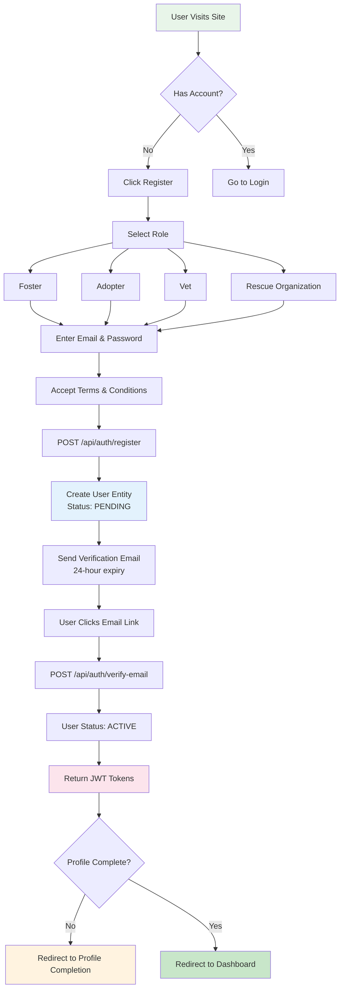

### 1.2 User Login Flow

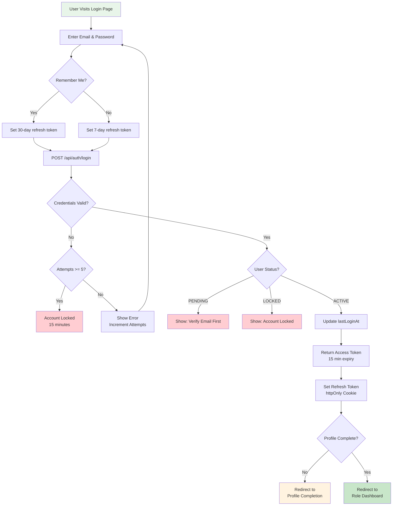

### 1.3 Token Refresh Flow

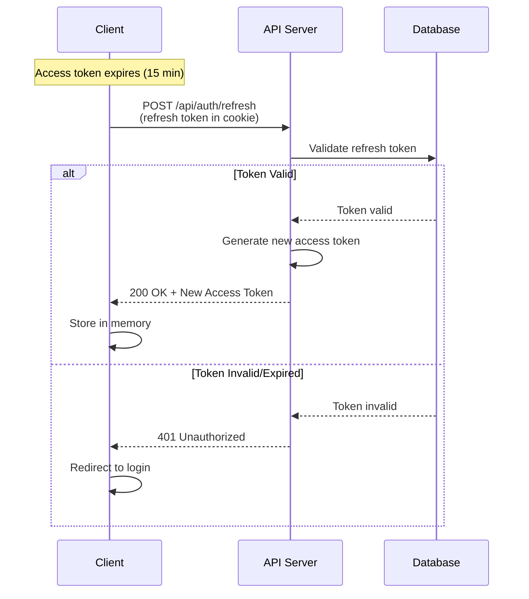

### 1.4 Password Recovery Flow

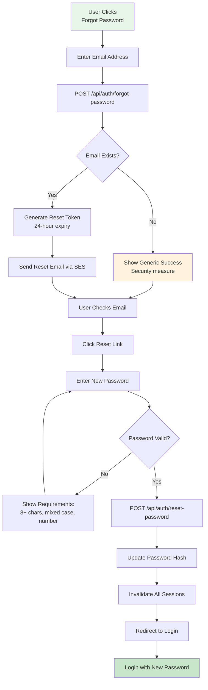

### 1.5 Logout Flow

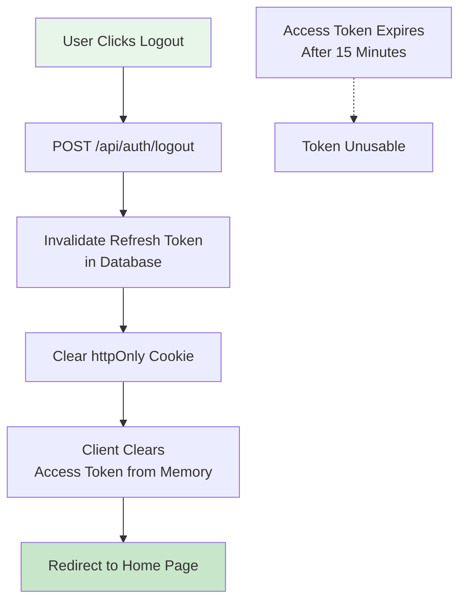

---

## 2. Pet Registration Flow (Foster)

### 2.1 Complete Foster Profile

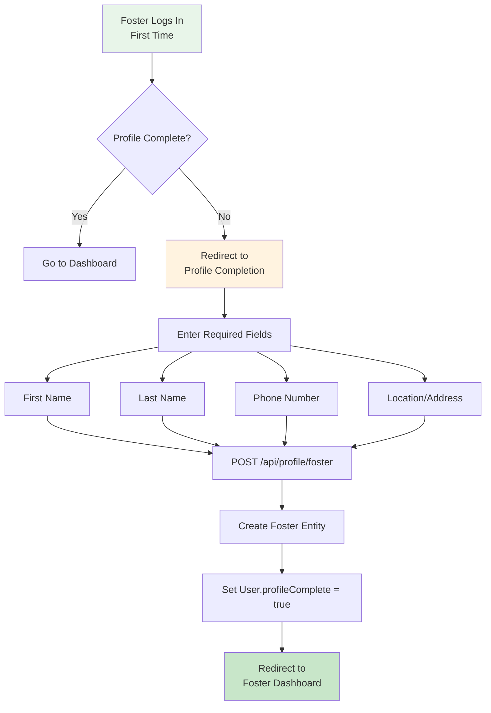

### 2.2 Pet Registration Process

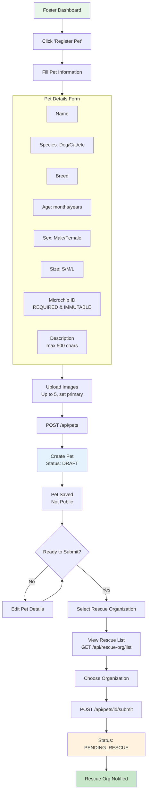

### 2.3 Full Pet Journey (Foster Perspective)

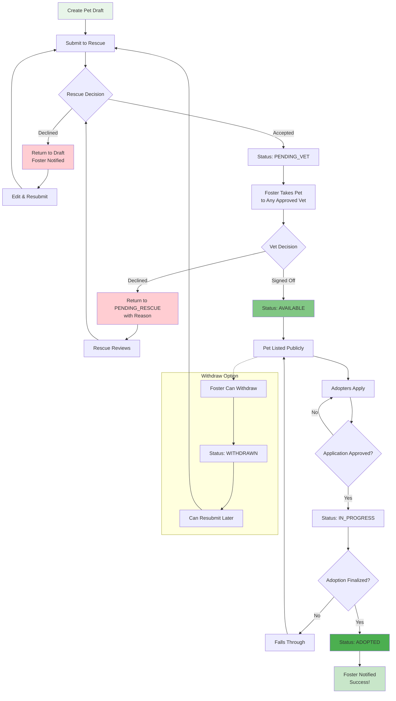

---

## 3. Adoption Flow (Adopter)

### 3.1 Browse & Search Pets (Public)

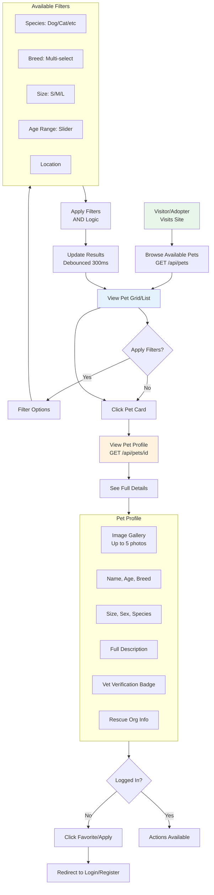

### 3.2 Adopter Registration & Profile

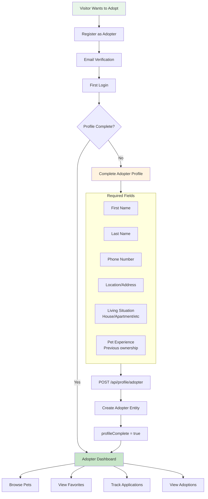

### 3.3 Submit Adoption Application

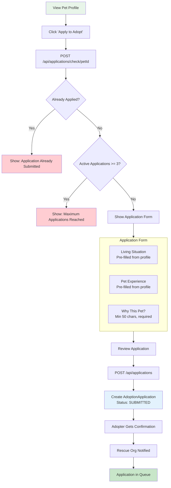

### 3.4 Application Review & Adoption

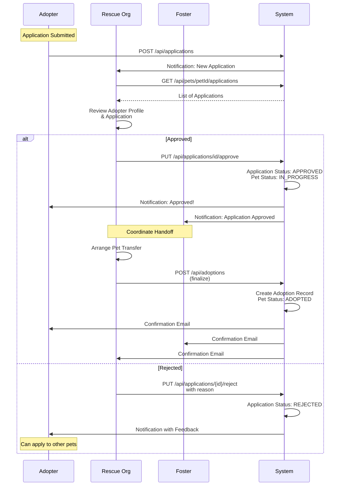

### 3.5 Track Application Status

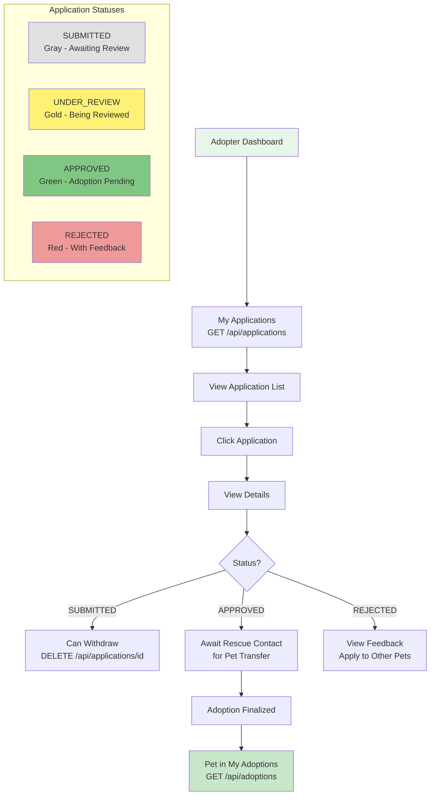

---

## 4. Vet Verification Flow

### 4.1 Vet Registration & Approval

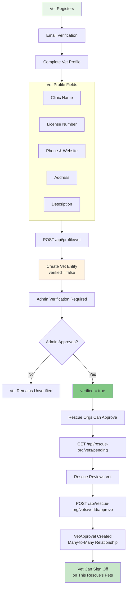

### 4.2 Pet Lookup & Verification

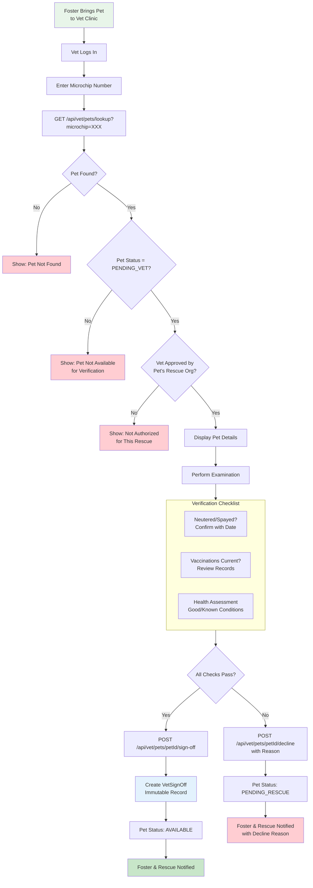

### 4.3 Vet Sign-Off Details

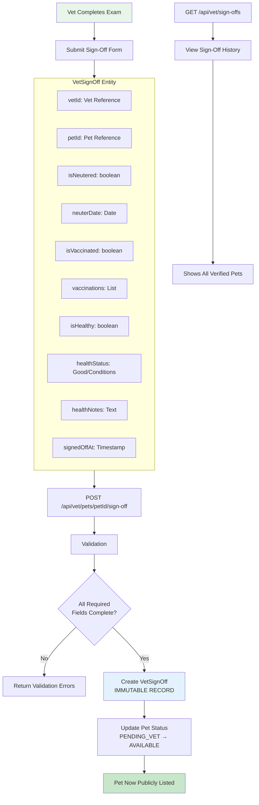

---

## 5. Rescue Organization Flow

### 5.1 Rescue Organization Setup

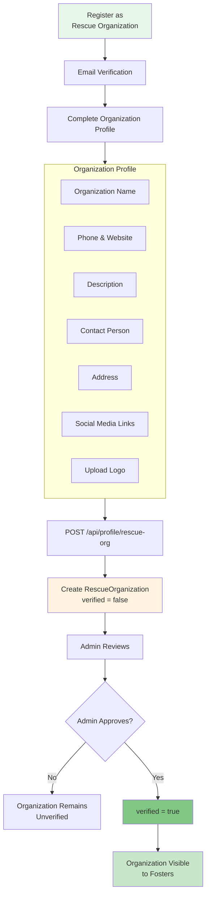

### 5.2 Pet Management (Rescue Perspective)

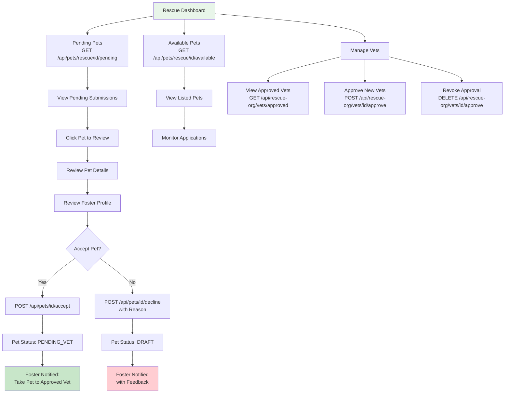

### 5.3 Application & Adoption Management

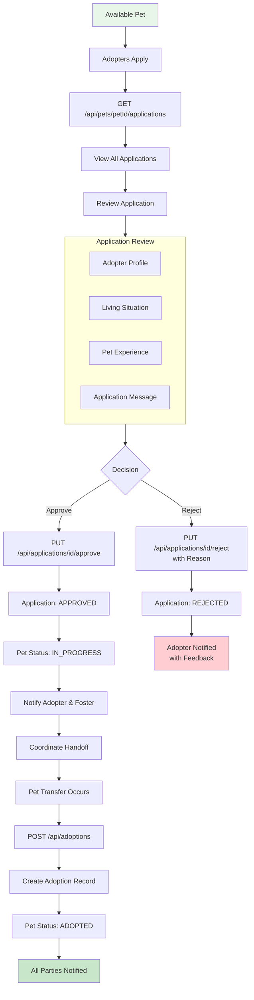

---

## 6. Pet Status Lifecycle

### 6.1 Complete State Machine

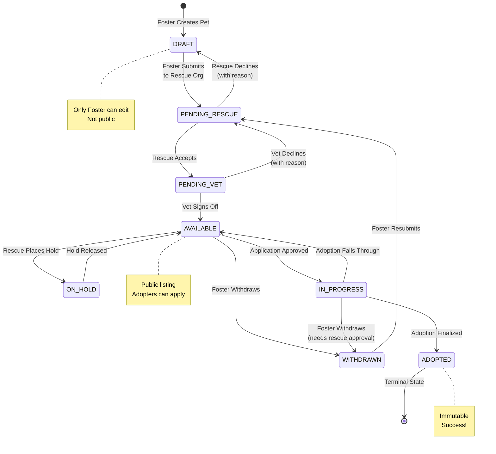

### 6.2 Status Transition Matrix

```mermaid
flowchart LR
    subgraph Private[Private States]
        DRAFT[DRAFT<br/>Foster editable]
        PENDING_RESCUE[PENDING_RESCUE<br/>Awaiting review]
        PENDING_VET[PENDING_VET<br/>Awaiting verification]
    end

    subgraph Public[Public States]
        AVAILABLE[AVAILABLE<br/>Listed for adoption]
        ON_HOLD[ON_HOLD<br/>Temporarily unavailable]
        IN_PROGRESS[IN_PROGRESS<br/>Adoption pending]
    end

    subgraph Terminal[Terminal States]
        ADOPTED[ADOPTED<br/>Successfully rehomed]
        WITHDRAWN[WITHDRAWN<br/>Can resubmit]
    end

    DRAFT --> PENDING_RESCUE
    PENDING_RESCUE --> DRAFT
    PENDING_RESCUE --> PENDING_VET
    PENDING_VET --> PENDING_RESCUE
    PENDING_VET --> AVAILABLE
    AVAILABLE --> ON_HOLD
    ON_HOLD --> AVAILABLE
    AVAILABLE --> IN_PROGRESS
    IN_PROGRESS --> AVAILABLE
    AVAILABLE --> WITHDRAWN
    IN_PROGRESS --> WITHDRAWN
    IN_PROGRESS --> ADOPTED
    WITHDRAWN --> PENDING_RESCUE

    style DRAFT fill:#E0E0E0
    style PENDING_RESCUE fill:#FFF9C4
    style PENDING_VET fill:#FFE0B2
    style AVAILABLE fill:#C8E6C9
    style ON_HOLD fill:#B3E5FC
    style IN_PROGRESS fill:#CE93D8
    style ADOPTED fill:#4CAF50,color:#fff
    style WITHDRAWN fill:#FFCDD2
```

### 6.3 Who Can Do What

```mermaid
flowchart TD
    subgraph Roles[User Roles & Permissions]
        F[FOSTER]
        R[RESCUE ORG]
        V[VET]
        A[ADOPTER]
        AD[ADMIN]
    end

    subgraph FosterActions[Foster Actions]
        F1[Create Pet Draft]
        F2[Edit Draft/PendingRescue]
        F3[Submit to Rescue]
        F4[Withdraw Pet]
        F5[View Pet Status]
    end

    subgraph RescueActions[Rescue Actions]
        R1[Accept/Decline Pets]
        R2[Approve/Revoke Vets]
        R3[Review Applications]
        R4[Approve/Reject Applications]
        R5[Finalize Adoptions]
        R6[Place Pet on Hold]
    end

    subgraph VetActions[Vet Actions]
        V1[Lookup Pet by Microchip]
        V2[Sign Off on Pet]
        V3[Decline Pet]
        V4[View Sign-Off History]
    end

    subgraph AdopterActions[Adopter Actions]
        A1[Browse Available Pets]
        A2[Save Favorites]
        A3[Submit Applications]
        A4[Track Applications]
        A5[View Adoptions]
    end

    subgraph AdminActions[Admin Actions]
        AD1[Verify Vets]
        AD2[Verify Rescue Orgs]
        AD3[View Analytics]
        AD4[Moderate Content]
    end

    F --> FosterActions
    R --> RescueActions
    V --> VetActions
    A --> AdopterActions
    AD --> AdminActions

    style F fill:#81D4FA
    style R fill:#A5D6A7
    style V fill:#FFCC80
    style A fill:#CE93D8
    style AD fill:#EF9A9A
```

---

## 7. Notification Flow

### 7.1 System Notifications

```mermaid
flowchart TD
    subgraph Triggers[Notification Triggers]
        T1[Pet Status Change]
        T2[Application Received]
        T3[Application Status Change]
        T4[Vet Sign-Off]
        T5[Adoption Finalized]
    end

    subgraph Recipients[Notification Recipients]
        R1[Foster]
        R2[Adopter]
        R3[Rescue Org]
        R4[Vet]
    end

    T1 --> |Pet accepted| R1
    T1 --> |Pet goes available| R1
    T1 --> |Favorited pet changes| R2

    T2 --> R3

    T3 --> |Approved| R2
    T3 --> |Approved| R1
    T3 --> |Rejected| R2

    T4 --> R1
    T4 --> R3

    T5 --> R1
    T5 --> R2
    T5 --> R3
    T5 --> R4

    subgraph Channels[Delivery Channels]
        C1[In-App Notification]
        C2[Email via AWS SES]
    end

    R1 & R2 & R3 & R4 --> Channels

    style T1 fill:#E3F2FD
    style T2 fill:#E8F5E9
    style T3 fill:#FFF3E0
    style T4 fill:#FCE4EC
    style T5 fill:#F3E5F5
```

---

## Quick Reference: API Endpoints

### Authentication
| Endpoint | Method | Description |
|----------|--------|-------------|
| `/api/auth/register` | POST | Create new account |
| `/api/auth/login` | POST | Authenticate user |
| `/api/auth/refresh` | POST | Refresh access token |
| `/api/auth/logout` | POST | Invalidate session |
| `/api/auth/verify-email/{token}` | POST | Verify email |
| `/api/auth/forgot-password` | POST | Request password reset |
| `/api/auth/reset-password` | POST | Reset password |

### Pets
| Endpoint | Method | Description |
|----------|--------|-------------|
| `/api/pets` | GET | List available pets (public) |
| `/api/pets` | POST | Create pet (Foster) |
| `/api/pets/{id}` | GET | Get pet details |
| `/api/pets/{id}` | PUT | Update pet (Foster) |
| `/api/pets/{id}/submit` | POST | Submit to rescue |
| `/api/pets/{id}/accept` | POST | Accept pet (Rescue) |
| `/api/pets/{id}/decline` | POST | Decline pet (Rescue) |
| `/api/pets/{id}/withdraw` | POST | Withdraw pet (Foster) |
| `/api/pets/my` | GET | Foster's pets |
| `/api/pets/lookup` | GET | Lookup by microchip (Vet) |

### Applications
| Endpoint | Method | Description |
|----------|--------|-------------|
| `/api/applications` | GET | My applications (Adopter) |
| `/api/applications` | POST | Submit application |
| `/api/applications/{id}` | DELETE | Withdraw application |
| `/api/applications/{id}/approve` | PUT | Approve (Rescue) |
| `/api/applications/{id}/reject` | PUT | Reject (Rescue) |
| `/api/pets/{petId}/applications` | GET | Pet's applications (Rescue) |

### Vet
| Endpoint | Method | Description |
|----------|--------|-------------|
| `/api/vet/pets/{petId}/sign-off` | POST | Sign off on pet |
| `/api/vet/pets/{petId}/decline` | POST | Decline pet |
| `/api/vet/sign-offs` | GET | Sign-off history |
| `/api/vet/rescue-orgs` | GET | Approved rescues |

### Adoptions
| Endpoint | Method | Description |
|----------|--------|-------------|
| `/api/adoptions` | GET | My adoptions |
| `/api/adoptions` | POST | Finalize adoption (Rescue) |

---

## Color Legend

| Color | Meaning |
|-------|---------|
| Green (#E8F5E9, #C8E6C9) | Start/Success states |
| Blue (#E3F2FD) | Data creation/storage |
| Orange (#FFF3E0) | Pending/In-progress states |
| Red (#FFCDD2) | Error/Declined states |
| Purple (#FCE4EC, #F3E5F5) | Token/Security related |
| Gray (#E0E0E0) | Neutral/Initial states |

---

*Generated for Forever Home Pet Adoption Platform*
